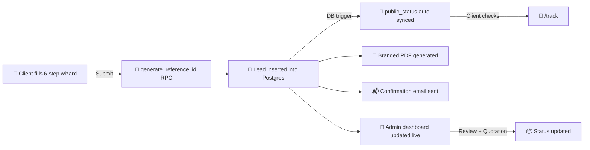

<div align="center">


<br/>

[](https://github.com/Nayeem131136/mt-web-studio)
&nbsp;
[](https://vercel.com)
&nbsp;
[](https://supabase.com)
&nbsp;
[](https://react.dev)
&nbsp;
[](LICENSE)

<br/>


</div>

---

## 📖 About

**MT Web Studio CRM** is the client onboarding and lead management system for **MT Web Studio**, a Bangladesh-based web development agency. Instead of a plain contact form, clients go through a premium 6-step animated wizard — business info, package selection, requirements, design preferences, file uploads, and a final review — before a branded, bilingual (English/Bangla) PDF and a collision-proof reference ID are generated automatically. Admins get a full CRM: real-time lead management, a live quotation calculator, notes, and one-click WhatsApp/call/email actions. Clients can track their own project status anytime, without needing an account.

> *"Not a Google Form. A professional onboarding experience."*

---

## ✨ Key Features

<div align="center">

| Feature | Description |
|---|---|
| 🧙 **6-Step Animated Wizard** | Business → Package → Features → Design → Content → Review, with autosave (resumes if the browser closes mid-form) |
| 📦 **3-Tier Package Selector** | Starter / Business / Premium pricing cards with a feature comparison table, domain & hosting kept clearly separate |
| 📁 **Real File Uploads** | Logo, photos, menu/price list — uploaded live to Supabase Storage with animated progress |
| 🔢 **Collision-Proof Reference IDs** | `MT-YYYY-XXXX` generated via an atomic Postgres function — no duplicates, ever |
| 📄 **Branded Bilingual PDF** | Auto-generated project requirement document, renders English *and* Bangla correctly (Noto Sans Bengali embedded) |
| 📬 **Automatic Confirmation Email** | Sent on submission via EmailJS — free tier, no backend server needed |
| 📍 **Client Status Tracker** | `/track` — clients check project progress by reference ID, with zero PII exposed |
| 🖥️ **Admin CRM Dashboard** | Paginated leads, search/filter, notes, priority & status pipeline, live quotation calculator |
| 💬 **WhatsApp-First Contact** | Floating WhatsApp button + one-click chat/call/email from every lead |
| 🔐 **Admin Allowlist Auth** | Email/password sign-in (Supabase Auth), gated by an explicit email allowlist enforced in Postgres Row Level Security — not just the UI |

</div>

---

## 🛠️ Tech Stack

<div align="center">


</div>

---

## 🏗️ Project Structure

```
mt-web-studio/
├── 🎨 src/
│   ├── pages/                # Landing, 6-step wizard, /track, /admin
│   ├── components/
│   │   ├── ui/                # Magic UI-style blocks — border-beam, shimmer-button,
│   │   │                       marquee, spotlight-card, number-ticker, file-drop, save-toast
│   │   └── WhatsAppFloatingButton.tsx
│   ├── lib/
│   │   ├── pdf.tsx             # Bilingual branded PDF generator
│   │   ├── phone.ts            # +880 phone/WhatsApp normalization
│   │   ├── refId.ts            # Reference ID generation (calls Postgres RPC)
│   │   ├── leadMapper.ts       # camelCase (app) <-> snake_case (Postgres) conversion
│   │   ├── email.ts            # EmailJS confirmation email
│   │   └── translations.ts     # English/Bangla UI toggle
│   ├── assets/fonts/           # Noto Sans Bengali (for the PDF)
│   └── supabase.ts             # Supabase client
├── 🗄️ supabase-schema.sql       # Tables, RPC functions, triggers, RLS policies, storage bucket
├── seed.ts                     # Demo lead seeding script
├── vercel.json                 # SPA rewrite config
└── package.json
```

---

## 🔄 How It Works



---

## ⚙️ Installation & Setup

```bash
# 1. Clone the repository
git clone https://github.com/Nayeem131136/mt-web-studio.git
cd mt-web-studio

# 2. Install dependencies
npm install

# 3. Copy environment variables
cp .env.example .env.local
# then fill in the values (see "Setting up Supabase" below)

# 4. Run locally
npm run dev

# 5. Type-check before shipping
npm run lint
```

---

## 🗄️ Setting up Supabase

1. Create a free project at [supabase.com](https://supabase.com)
2. Open the **SQL Editor** → New Query → paste the **entire contents** of
   [`supabase-schema.sql`](./supabase-schema.sql) → **Run**. This creates the
   `leads` / `public_status` / `ref_counters` tables, the atomic reference-ID
   function, the auto-sync trigger, all Row Level Security policies, and the
   `uploads` storage bucket.
3. In the SQL you just ran, find `is_admin()` and replace
   `'admin@mtwebstudio.com'` with your real admin email — this is the actual
   security boundary (the app's client-side check is just a UX convenience).
4. **Authentication → Providers** → make sure **Email** is enabled.
5. **Authentication → Users → Add user** → create your admin login with the
   *same* email as in `is_admin()` and a password you'll remember.
6. **Project Settings → API** → copy your **Project URL** and **anon/publishable key**
   into `.env.local` as `VITE_SUPABASE_URL` and `VITE_SUPABASE_ANON_KEY`.

Unlike Firebase, there's no separate "authorized domains" step for email/password
login — it works from any domain out of the box, so this alone fixes the
`auth/unauthorized-domain`-style headaches for good.

---

## 🚀 Deploy Your Own (Vercel)

```bash
git init
git add .
git commit -m "Initial commit: MT Web Studio CRM"
git branch -M main
git remote add origin https://github.com/Nayeem131136/mt-web-studio.git
git push -u origin main
```

Then on **[vercel.com/new](https://vercel.com/new)**:

1. Import the `mt-web-studio` repo
2. Add these environment variables under **Project Settings → Environment Variables**:

   | Variable | Value |
   |---|---|
   | `VITE_ADMIN_EMAILS` | your real admin email (comma-separated, no spaces) |
   | `VITE_SUPABASE_URL` | from Supabase → Project Settings → API |
   | `VITE_SUPABASE_ANON_KEY` | from Supabase → Project Settings → API |
   | `VITE_EMAILJS_SERVICE_ID` | your EmailJS service ID |
   | `VITE_EMAILJS_TEMPLATE_ID` | your EmailJS template ID |
   | `VITE_EMAILJS_PUBLIC_KEY` | your EmailJS public key |

3. Click **Deploy** 🚀

`vercel.json` already handles SPA routing (`/start`, `/track`, `/admin` won't 404 on
refresh). Every push to `main` auto-redeploys.

---

## 🧭 Usage

| Step | Action |
|---|---|
| 1️⃣ | Client opens `/start`, fills business info, picks a package |
| 2️⃣ | Selects requirements, design preferences, uploads logo/photos |
| 3️⃣ | Reviews everything on the final step, confirms, and submits |
| 4️⃣ | Gets a reference ID + PDF instantly, and a confirmation email shortly after |
| 5️⃣ | Admin logs in at `/admin` (email/password), prepares a quotation, updates status |
| 6️⃣ | Client checks progress anytime at `/track` using their reference ID |

---

## 🗺️ Roadmap

- [ ] Payment gateway integration (bKash/Nagad) for advance payments
- [ ] Multi-admin roles (staff accounts with limited permissions)
- [ ] Code-split `/admin` from the public `/start` bundle for faster mobile loads
- [ ] SMS confirmation as a fallback alongside email

---

## 👤 Developer

<div align="center">

| Name | Role | GitHub |
|---|---|---|
| **Md. Mahdi Hasan Nayeem** | 🏆 Creator & Developer | [@Nayeem131136](https://github.com/Nayeem131136) |

**Portfolio:** [mahdi-hasan-nayeem-portfolio.vercel.app](https://mahdi-hasan-nayeem-portfolio.vercel.app/)

</div>

---

<div align="center">


**⭐ Star this repo if it helped you! | 🍴 Fork to build your own**

[](https://github.com/Nayeem131136/mt-web-studio/stargazers)
&nbsp;
[](https://github.com/Nayeem131136/mt-web-studio/network/members)

*Built with 🖤 by Md. Mahdi Hasan Nayeem*

</div>
